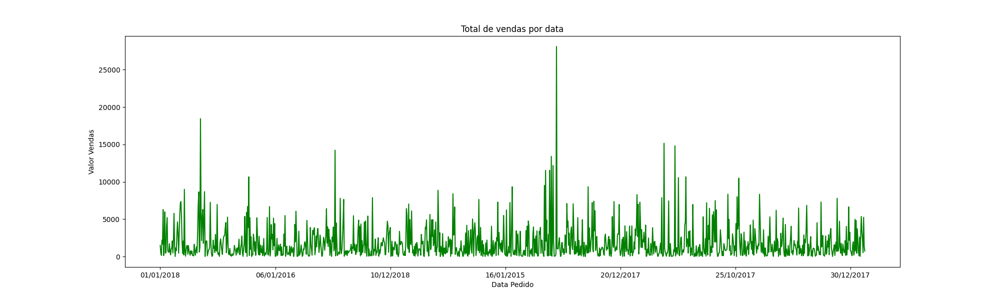
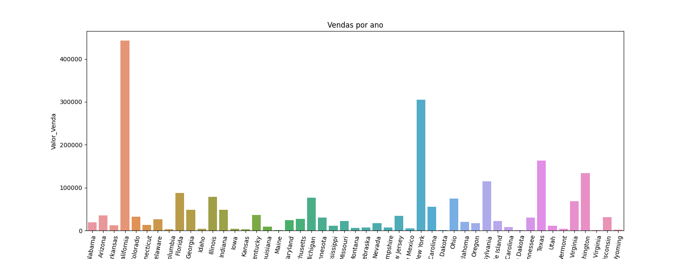
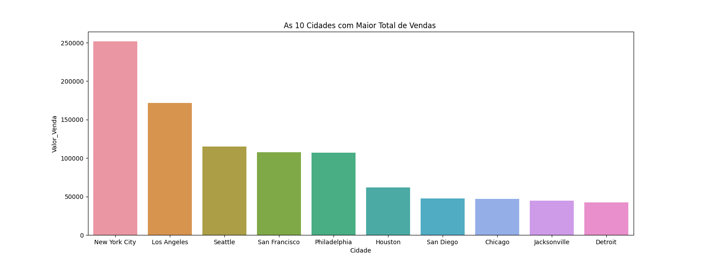
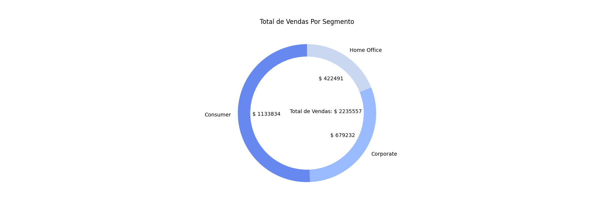
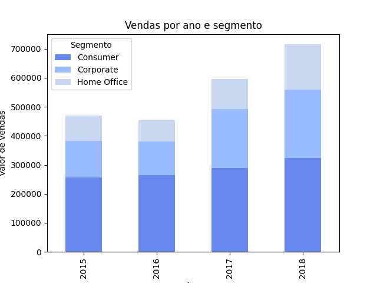
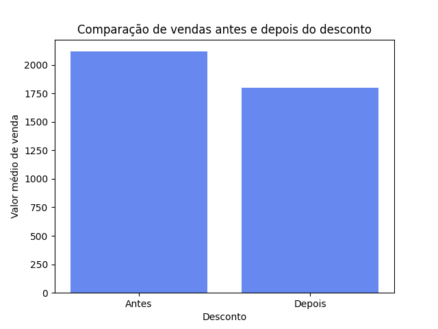
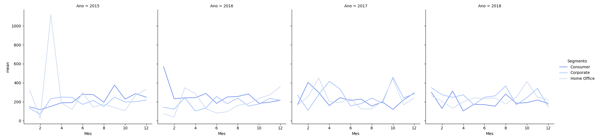

# Sales Analitycs 
É um projeto de analise de dados de um dataset composto por informações de pedidos realizados por clientes nos Estados Unidos em diferentes segmentos e categorias de produtos, incluindo mobiliário, suprimentos de escritório e tecnologia. As informações incluem o ID do pedido, data do pedido, ID do cliente, segmento, país, cidade, estado, ID do produto, categoria, subcategoria e valor da venda. Esses dados podem ser usados para análise de vendas, segmentação de clientes, previsão de demanda, entre outras análises de negócios. 
A logica do projeto se encontra em "features/data_query.py" que transforma as consultas em graficos com seaborn e matplot.

## São extraidos as seguintes informações dos dados:

- A cidade com o maior valor de vendas de produtos na categoria 'Materiais de escritório';
Esse é apenas uma consulta básica com pandas que retorna ``A cidade com maior valor de vendas de produtos na categoria 'Materiais de escritório' é New York City``

- O total de vendas por data de pedido;

- O total de vendas por estado;

- As 10 cidades com o maior total de vendas;

- O segmento com maior valor de vendas;

- O total de vendas por ano e segmento;

- A comparação das vendas antes e depois do desconto;

- A média de vendas por segmento, ano e mês.

## Como usar:
Caso queita testar o menu, as dependencias necessarias são:

- pandas
- numpy
- seaborn
- matplot
 
Para instalar basta apenas usar o comando `` pip install -r requirements.txt``.
Logo em seguida so executar o arquivo main.py.
